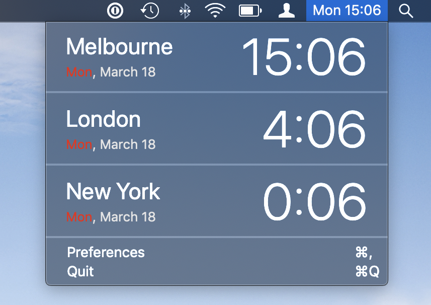
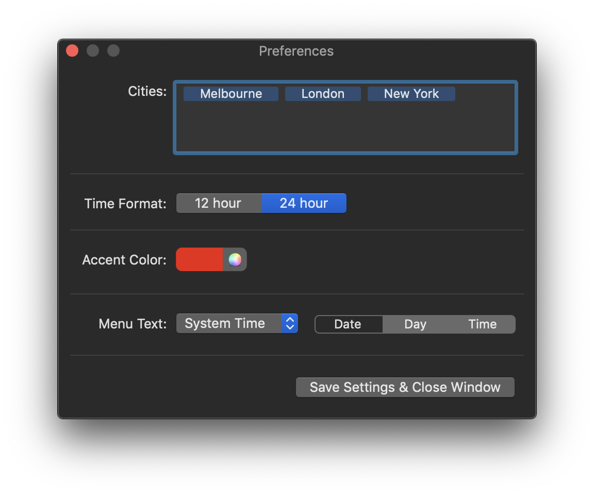

# WorldClock  
> MacOS world clock app.

A replacement for the existing MacOS clock menubar applet. Provides all the functions of the default system applet with the addition of customizable clock widgets for user-speicifed cities.

## Installation
Just grab the latest release from the releases tab, or build from source following the instrutions below.

## Building
Open the project in Xcode and build. No need to do anything else.

## Settings

- Cities: The list of cities to keep clocks of. Populates from `Foundation`'s `Timezone.knownTimezoneIdentifiers`
- Time Format: 12 or 24 hour time.
- Accent Color: Accent color for Day value in clock widgets.
- Menu Text: Three options
	- System Time: Current system time, live updating. Customizable to show date/day/time. Uses 12/24-hour time as specified above
	- App Name: The name of the app
	- Icon: A little clock icon

## License
`WorldClock` is available under a GPLv3 license. See the LICENSE file for more details.

## Dependencies
- [ComboColorWell](https://github.com/erne/ComboColorWell) - Fancy color picker, MIT licence
- [ACBTokenField](https://github.com/akhilcb/ACBTokenField) - Easier Token field, MIT license